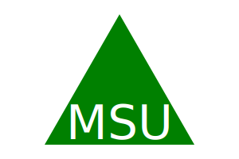

# SVG Logo Maker [](./LICENSE)

* This application prompts the user to select a color and shape, provide text for the logo, and save the generated SVG to a `.svg` file.

## Table of Contents

* [Description](#description)
* [Technology](#technology)
* [Installation](#installation)
* [Usage](#usage)
* [Tests](#tests)
* [SVG Resources](#svg-resources)
* [Walkthrough Video](#walkthrough-video)
* [Links](#links)
* [License](#license)

## Description

```md
AS a freelance web developer
I WANT to generate a simple logo for my projects
SO THAT I don't have to pay a graphic designer
```

[*back to top*](#table-of-contents)

## Technology

* [](https://nodejs.org/en)

* [](https://docs.npmjs.com/cli/v9/)
  * [](https://www.npmjs.com/package/inquirer)
  * [](https://www.npmjs.com/package/jest)
  * [](https://www.npmjs.com/package/mock-fs)

[*back to top*](#table-of-contents)

## Installation

* Packages to support this application can be installed by using [*npm install*](https://docs.npmjs.com/cli/v9/commands/npm-install) commands.

> **Note**: If you do not have a `package.json` in your directory already, enter command below to [*initiate*](https://docs.npmjs.com/cli/v9/commands/npm-init).
>
>```bash
>npm init -y
>```
>
>```bash
>npm i inquirer@8.2.5 jest@29.6.1 mock-fs@5.2.0
>```
>
> **Important**: Make sure to @ the **EXACT** versions as shown above.

[*back to top*](#table-of-contents)

## Usage

* This application can be invoked by using the following command:

```bash
node index.js
```

* Workflow:

```md
GIVEN a command-line application that accepts user input
WHEN I am prompted for text
THEN I can enter up to three characters
WHEN I am prompted for the text color
THEN I can enter a color keyword (OR a hexadecimal number)
WHEN I am prompted for a shape
THEN I am presented with a list of shapes to choose from: circle, triangle, and square
WHEN I am prompted for the shape's color
THEN I can enter a color keyword (OR a hexadecimal number)
WHEN I have entered input for all the prompts
THEN an SVG file is created named `{text}-{shape}-logo.svg`
AND the output text "Generated {text}-{shape}-logo.svg" is printed in the command line
WHEN I open the `{text}-{shape}-logo.svg` file in a browser
THEN I am shown a 300x200 pixel image that matches the criteria I entered
```

[*back to top*](#table-of-contents)

## Tests

> **Note**: You must have ***Jest***, ***Mock-fs*** and ***Inquirer*** packages installed before running any tests. See [Installation](#installation).

* Each shape class could be tested for a `render()` method that returns a string for the corresponding SVG file with the given shape color.

* To run a specific test *e.g.* `shapes.test.js`, use the command below:

```bash
npm run test shapes.test.js
```

* To run all tests at once, use the command below:

```bash
npx jest
```

[*back to top*](#table-of-contents)

## SVG Resources

* [Example SVG](https://static.fullstack-bootcamp.com/fullstack-ground/module-10/circle.svg)
* [Scalable Vector Graphics (SVG)](https://en.wikipedia.org/wiki/Scalable_Vector_Graphics)
* [SVG tutorial](https://developer.mozilla.org/en-US/docs/Web/SVG/Tutorial)
* [Basic SVG shapes](https://developer.mozilla.org/en-US/docs/Web/SVG/Tutorial/Basic_Shapes)
* [Text in SVG](https://developer.mozilla.org/en-US/docs/Web/SVG/Tutorial/Texts)
* [SVG VS Code extension](https://marketplace.visualstudio.com/items?itemName=jock.svg)

[*back to top*](#table-of-contents)

## Walkthrough Video

* A walkthrough video that demonstrates the functionality of the SVG logo maker and passing tests must be submitted.
  <!-- * [](https://drive.google.com/file/WALKTHROUGH-VIDEO-FOR-SVG-LOGO-MAKER) -->

* The walkthrough video must show all tests passing from the command line.

* Demonstrate how a user would invoke the application from the command line.

```bash
node index.js
```

* Demonstrate how a user would enter responses to all of the prompts in the application.
* Demonstrate a generated SVG file, showing the file being opened in the browser. The image in the browser must reflect the choices made by the user (text, shape, and colors).

[*back to top*](#table-of-contents)

## Links

[](https://rb.gy/kh9be)

* GitHub Repo: [SVG Logo Maker](https://github.com/Ronin1702/SVG-Logo-Maker)
* Walkthrough Video Link:
* SVG Sample:





[*back to top*](#table-of-contents)

## License

* This application is licensed by [](./LICENSE).

[*back to top*](#table-of-contents)

---

